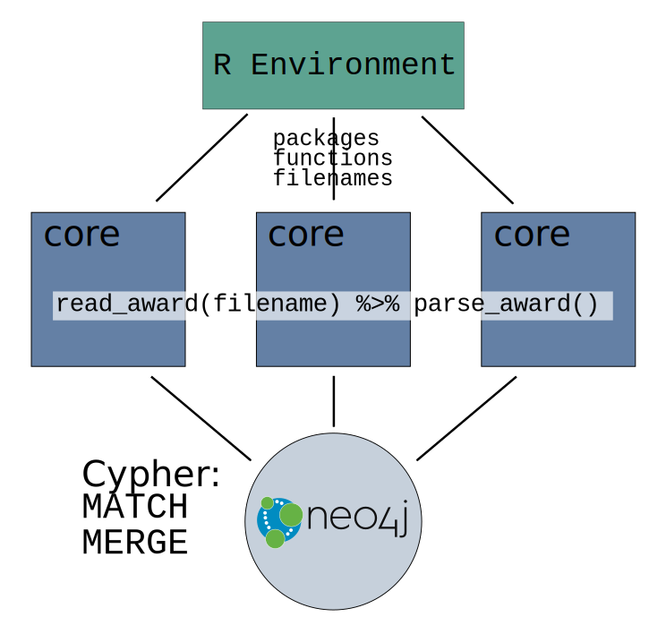

# Introduction

I've been incorporating more and more `dplyr` and `purrr` into my workflows.  Even going so far as to revisit old code to try it out and see whether this cleans up the code, or, potentially speeds it up.

In general, I like it a lot.  It speaks to the increasing utility and appeal of the `dplyr` workflow that it's becoming more and more popular.  This article continues work I presented in [my post about using [neo4j](https://neo4j.com/) and [R](https://cran.r-project.org/) with the [RNeo4j](https://neo4j.com/developer/r/) package.

# Getting Set Up

For this post I wound up downloading the entirety of the [NSF's awards database](https://www.nsf.gov/awardsearch/download.jsp).  This consists of a large number of XML files, aggregated into zip files, organized by year.  I am using my [EC_Network](https://github.com/SimonGoring/EC_Network) repository on GitHub to manage the development, and I set up a project folder with the following structure:

```
.
+-- timing_multiplyr.Rmd
+-- nsf_award_analysis.Rmd
+-- Data
  +-- input
    +-- Awards
      +-- ... (all awards)
  +-- output
    +-- parallel_timer.csv
+-- R
  +-- mergeRel.R
  +-- mergeNode.R
  +-- read_award.R
  +-- collapse_list.R
  +-- parse_award.R

```

I'm running all of this on a new system, using Ubuntu 16.04.  My `sessionInfo()` looks like this:

```
R version 3.2.3 (2015-12-10)
Platform: x86_64-pc-linux-gnu (64-bit)
Running under: Ubuntu 16.04.1 LTS

locale:
 [1] LC_CTYPE=en_CA.UTF-8       LC_NUMERIC=C               LC_TIME=en_CA.UTF-8       
 [4] LC_COLLATE=en_CA.UTF-8     LC_MONETARY=en_CA.UTF-8    LC_MESSAGES=en_CA.UTF-8   
 [7] LC_PAPER=en_CA.UTF-8       LC_NAME=C                  LC_ADDRESS=C              
[10] LC_TELEPHONE=C             LC_MEASUREMENT=en_CA.UTF-8 LC_IDENTIFICATION=C       

attached base packages:
[1] stats     graphics  grDevices utils     datasets  methods   base     

other attached packages:
[1] xml2_1.1.0            RNeo4j_1.6.4          multidplyr_0.0.0.9000 purrr_0.2.2          
[5] dplyr_0.5.0          

loaded via a namespace (and not attached):
[1] magrittr_1.5   R6_2.2.0       assertthat_0.1 parallel_3.2.3 DBI_0.5-1      tools_3.2.3   
[7] tibble_1.2     Rcpp_0.12.8   
```

[The original script](https://github.com/SimonGoring/EC_Network/blob/fcf62c0ea0305ec941a0e19f5d2d338d3f285b9f/build_award_network.R) ran in two steps.  The first step simply read in the files.  There were over 400,000 files in the NSF dataset, each representing a single award to a single institution.  The awards were read in by chaining `read_xml()` and `as_list()` from the `xml2` package.  This then produced a long list of elements that could be processed.  From there I used `purrr`'s `map()` function to apply `read_award()` and then the `parse_award()` function to each filename.

The actual [`parse_award()` function](https://github.com/SimonGoring/EC_Network/blob/master/R/parse_award.R) doesn't really return anything.  It takes all the elements from each XML file and turns them into nodes & relationships within a graph, similar to the one described in my previous post using `neo4j` and R.  There is now more information in each node, including more detailled information about the institution and the award itself.  The full schema for the NSF award XML files is available from multiple locations, including [this helpful GitHub repository](https://github.com/macks22/nsf-award-data/blob/master/docs/nsf-xml-schema-details.md).

Building the network was a fun exercise in debugging, commiting and error-checking.  The first run-through only processed about 20% of the 500 records I `sample()`d from the longer list.  I wrote a short command that would either build the network or return the file name so I could easily debug and test the code as I fixed it.  After a few itterations I managed to get code that rendered almost all of the awards seamlessly.

# The Case for Parallelization

Once things worked well, I then decided to just try running it overnight to see how it might work.  Leaving it overnight managed to only parse about 20% of the records.  I was looking into ways of parallelizing the operation, after all, it's really just opening up a few files.  There's no long operations, just many short ones.

I found a nice post on [Matt Dancho's website](http://www.mattdancho.com/) that [talks about using the `multiplyr` package](http://www.mattdancho.com/code-tools/2016/12/18/multidplyr.html).  Using the code laid out (to analyze S&P 500 data) I was able to write up a for loop that would open the same set of files, both parallelized and in series.

## Some Background

Most modern computers have multiple cores, but applications tend to run on only a single core. If you look at your system monitor, you'll often see that when R is running some analysis there's only a single core being used.


This isn't what things usually look like.  Each line here represents a single core on my laptop, and the short-duration ups and downs reflect each individual run of the `parse_awards()` function.

So, hopefully what we would see is a three-fold increase in speed if we parallelized to three cores (which I did).  The challenge with parallelization is that information needs to be shared across clusters.  In R you're basically creating a copy of your working environment  on each cluster, runing a subset of the jobs on each cluster, and then sending the results back to the master.

So, while you get the advantage of having the same job running on each cluster at the same time, you have the disadvantage of having to pass all that information back and forth.  This means that not all operations are worth parallelizing.  If you're about to go through the work of parallelizing something, make sure it's going to be worthwhile.

You can think of three elements for deciding when to parallelize:

1. Time to code/recode
2. Time of execution
3. Frequency of use

Here we can think of (1) as the effort required to actually implement the parallelization.  Whether it will save time is partly a matter of whether or not you consider using parallel processing in the first place, but also a matter of how complicated parallel processing is on your platform.  It's fairly straightforward in R.  Before using the `multidplyr` package I've had experience with `snow` and `snowball`.  Both work fairly well, and are fairly easy to implement.

Time of execution is simply a question of how long it's going to take to actually run the code.  If the whole script takes 10 seconds you're not going to need to parallelize it, unless you're really in a rush.  Check the bus schedule, when's the next bus coming, will parallelizing the script let you catch the bus, or can you wait?

Frequency of use is like a multiplier for the time of execution and time to code.  Maybe cutting down from 10 seconds isn't going to make you catch the bus once or twice, but if you're running you application hundreds or thousands of times, then parallelizing that one procedure could be worth it (if it actually saves you time). 

# Making it Work

For my purposes the time to recode was relatively short, aside from some bug-fixing needed I was able to use Matt Dancho's tutorial to fairly easily rewrite my code.  I already know that I'd be running the function itself several hundred thousand times, so the frequency of use is quite high, even if I'm only running the whole script once.  The last element then is knowing how time of execution might be affected.  I am optimistic that we ought to be able to save a significant amount of time.  When we look at the proposed schematic:



The way this system is set up, each core is both opening the XML file and then parsing it.  The only thing that goes from the parent to the child is the package information (using the `cluster_library()` call in `multidplyr`), the functions (using `cluster_get()`), and then the actual call, with only a character vector of file names.  The clusters themselves are parsing the XML file, and then sending a call to the `neo4j` database on the local server, so, again, there's nothing really to pass back.  The return value from the function is a `data.frame`, with four elements, so the `mutate()` call is returning a `tibble` that looks like this:

```
Source: local data frame [20 x 3]
Groups: group [1]

                           files group                lists
                           <chr> <dbl>               <list>
1  data/input/awards/8217004.xml     2 <data.frame [1 × 4]>
2  data/input/awards/1343432.xml     2 <data.frame [1 × 4]>
3  data/input/awards/0117919.xml     2 <data.frame [1 × 4]>
4  data/input/awards/0633128.xml     2 <data.frame [1 × 4]>
```

Again, a very small `return()` object, so, we would think that very little time and memory would be expended returning data from the clusters.

# Timing the Operation

When we time the operations we can look at the total time spent actually running the commands:

```{r, echo = FALSE, message = FALSE}

library(dplyr, quietly = TRUE)
library(tidyr, quietly = TRUE)

timer <- read.csv('data/output/parallel_timer.csv')

timer$X <- timer$X * 500

timer <- timer %>% gather(class, time, -X)

library(ggplot2)

ggplot(timer, aes(x = X, y = time)) + geom_line(aes(color = class)) +
  xlab('Files Processed') +
  ylab('System Time (sec)')

```

We can see a clear speed-up with the parallelization.  The parallel runs are more than 2x faster than the runs in serial, so we can see the penalty for the information exchange and managing the memory overhead (we're using three cores, so if information exchange was perfect we might expect to see a 3x increase).

# Continuing the Story

It's important to note that this is all implemented natively in R.  The other option would be to look at options native to neo4j, such as [bulk LOAD CSV or LOAD JSON tools](https://neo4j.com/blog/bulk-data-import-neo4j-3-0/) for data import.

My suspicion is that the effort of figuring out how to do the bulk data import natively is probably worth it, and would likely result in a much higher time savings than parallelizing in R.